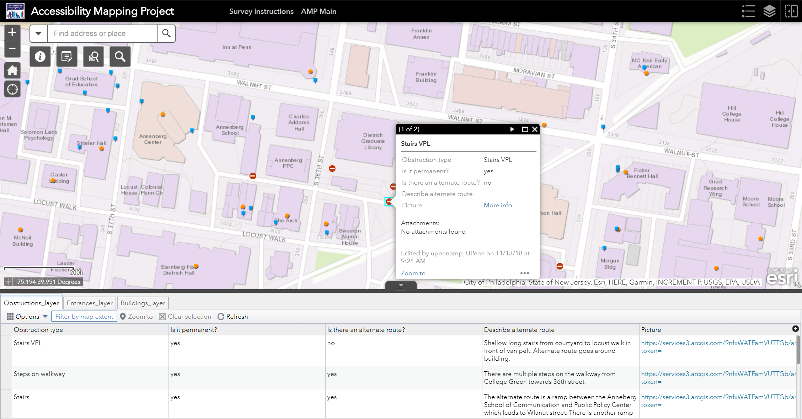
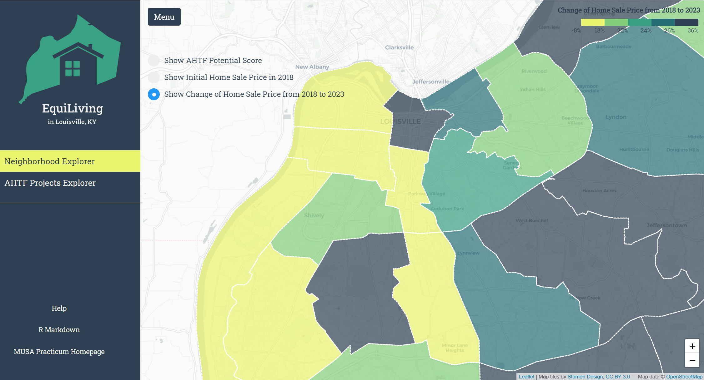
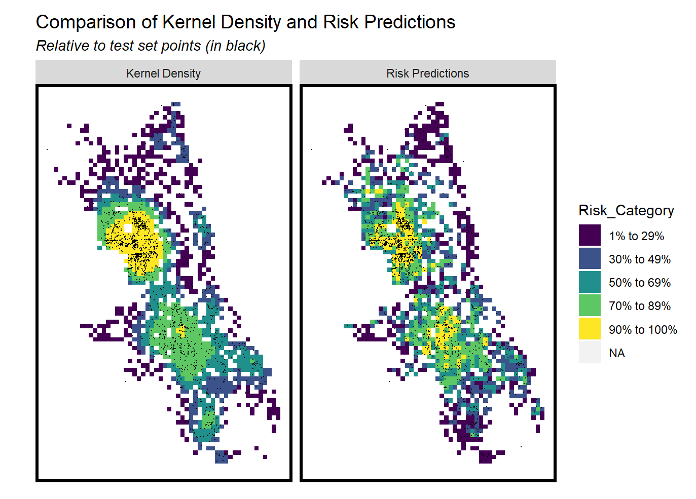
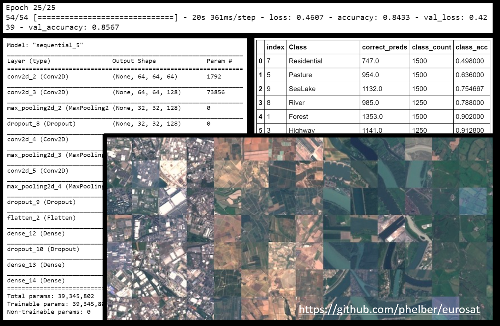
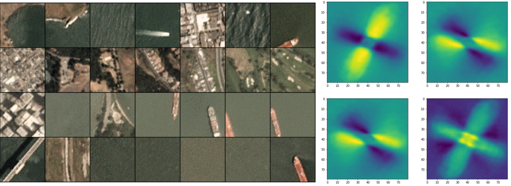
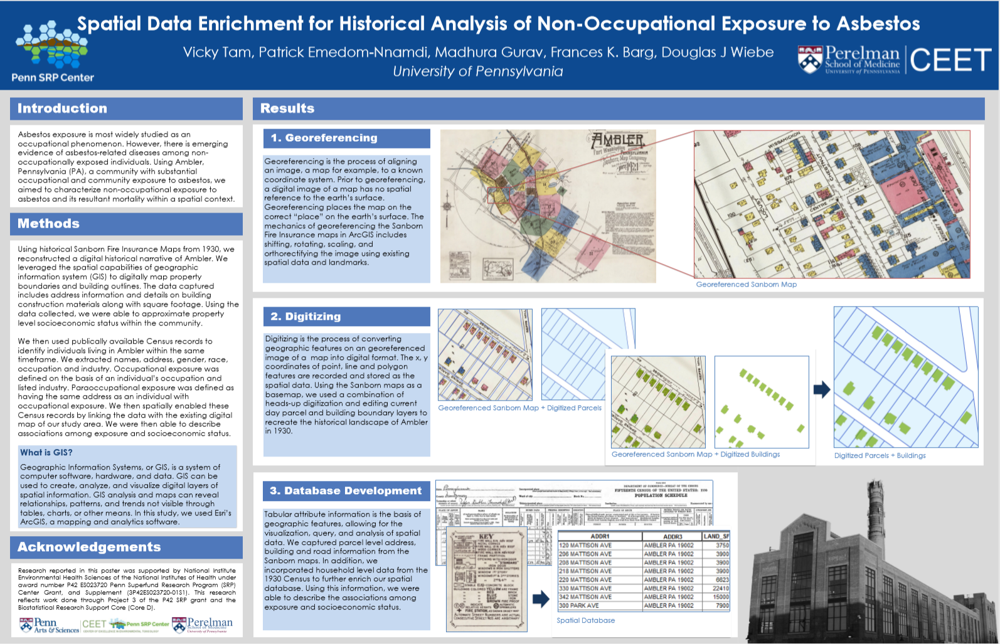

# Portfolio

---
## Webapp and GIS

- **[Access Mapping Project](http://web.sas.upenn.edu/access-map/)**
 
 

---
## RStudio

- **[Prioritizing allocation of Affordable Housing Trust Fund in Louisville, KY](/pdf/MUSA800_LouisvilleGentrification_JS.html)**
 
 
My team and I developed a model for predicting home sale price indices in Louisville, KY and identify housing market areas likely to gentrify in the future. Use the results of this model we created an app to help prioritize allocation of the city's limited funds while creating the most impact.
 
 
**Application dashboard: [EquiLiving](https://zxuanxu.github.io/EquiLivingAPP/#)**
 
 

 

- **[Geospatial Risk Prediction: Narcotics Crime in Chicago](/pdf/risk_pred_markdown.html)**
 
 

---

## Python

- **[EuroSAT Land Use and Land Cover Classification using Deep Learning](https://github.com/madhurapg/Remote-Sensing/blob/master/EuroSAT_landcover_classification.ipynb)**
 
 
This notebook contains five deep learning methods written in Python and compares their performance for land cover image classification. The EuroSAT dataset containing 27,000 Sentinel-2 satellite images  was used. Each image consists of 13 spectral bands and is pre-labeled labeled based on its major land use type.
 
 

 

- **[Ships in Satellite imagery - Classify ships in San Franciso Bay using Clustering](https://github.com/madhurapg/Remote-Sensing/blob/master/Ships_classification.ipynb)**
 
 
In this notebook, we use classify images using principal component analysis, clustering, svm classifier and grid search cross validation. The dataset used consists of images extracted from Planet satellite imagery of the San Francisco Bay and San Pedro Bay areas of California. There are 4000 80x80 RGB images labeled with either a "ship" or "no-ship" classification in the dataset.
 
 

---
## Conference poster and research

- **[Spatial Data Enrichment for Historical Analysis of Non-Occupational Exposure to Asbestos](/pdf/SRP_2017_meeting_poster.pdf)**
 
 
The research reported in this poster was supported by National Institute Environmental Health Sciences of the National Institutes of Health under award number P42 ES023720 Penn Superfund Research Program (SRP) Center Grant, and Supplement (3P42ES023720-01S1). This research reflects work done through Project 3 of the P42 SRP grant and the Biostatistical Research Support Core (Core D).
 
 

---

Page template forked from <a href="https://github.com/evanca/quick-portfolio">evanca</a>

<!-- Remove above link if you don't want to attibute -->
